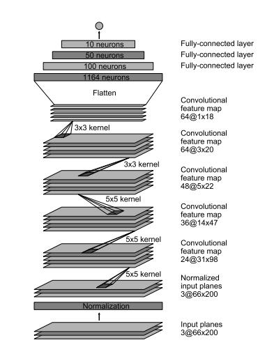
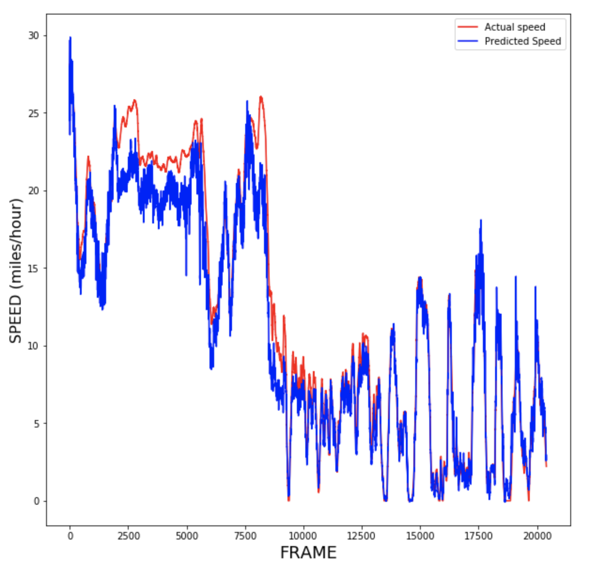

## Speed and Object Detection from Visual Feed (Video)
Team: [Akash](gvsakashb@u.northwestern.edu), [Bonga](siyabongamatchaba2021@u.northwestern.edu) & [Kartik](kartik.kesavabhotla@u.northwestern.edu)

### Intro

Currently, basic object detection enables users to understand higher-level abstractions
of images but however limits the user’s perception. In contrast to just displaying labeled
info and not other relevant details, our project will explored a scenario based on a
dashcam video, for use-case in the field of self-driving cars and navigation.

Our submisison expands to three sections and has worked on a speed detection challenge, attainign promising results with enough scope to expand beyond the videos, towards real-time use and for working more on advanced DNN models.

> Download the files for training and testing (data folder) from the comma.ai GitHub [repository](https://github.com/commaai/speedchallenge).

### Pipeline and architecture:
Main Tools: Caffe, PyTorch, CNNs, Single-shot MultiBox detectors, OpenCV

1. DL model - initial architecture & training
* To begin our exploration, we decided to start with a basic 8 layer convulational neural net. This net structure is an adaption of tensor flows implementation of a convolution net. However, instead of using the exact net structure, we altered its input dimension and output dimensions as well as its convolution layers in order to successful run our model on our video dataset. 
* The results of the model can be found at the bottom of the the "Speed Prediction DL.ipnyb" in the file "DLNotebook". The overall performance of this model indicated that there was not a significant predictive aspect of the model. 

 

2. Using Optical Flow (MSE ~5)

* This approach has expanded upon the baseline model and incorporated the techniques from Nvidia's [paper](https://arxiv.org/pdf/1604.07316.pdf) for object detection, mainly capitalizing on Optical Flow and image transformations to train the Neural Net.

i. Harnessing optical flow and training from consecutive image captures from video

ii. Incorporation of Multi-box detection & future work towards Real time detection

 

* After initial training and preprocessing, we observe that consectuive and multiple images are better than single images, pulled from the mp4 file.

3. Linear Regression Model

* Apart from DL curiosity and above models, we explored a bare-bones architecture built for object detection, and these files are available in the 'linearRegression' folder.
* This model has achieved an MSE value close to 6, but has used significantly lesser compute power. However, we see merit in expanding more for stage 2 model towards real-time detection with Caffe support.

 

### Implementation

1. Explore the ipynb and supported .py files

2. Ensure the supported libraries are installed (argparse, OpenCV/cv2, numpy)

* Kindly refer to final-rerun.py file for looking at our model. All the comments illsutrate each section from preprocessing, training and testing, with results saved in the 'dl-opt-flow' folder.
* For explanding and studying real-time detection, please see:
> python comma_play.py --video train.mp4

For this case, the pre-trained model and weidhts are needed, from MobileNetSSD, available online.

3. Please refer to solvers.py file and the generated graphs in lin-reg directory

### Future

The scope of this project and our curriculum has allowed us to deliver on the two models above. Beyond this, it can be expanded to Sensor Fusion, LIDAR or image processing problems and for domain of autonomous driving.
